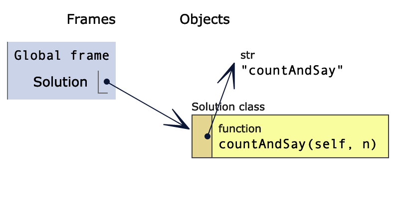

# leetcode2
## Rotated Sorted Array

# Count And Say
## 1,5:
['1', '11', '21', '1211', '111221']
## 2,7:
['1', '11', '21', '1211', '111221', '312211', '13112221']
## 5,12:
['1', '11', '21', '1211', '111221', '312211', '13112221', '1113213211', '31131211131221', '13211311123113112211', '11131221133112132113212221', '3113112221232112111312211312113211']

